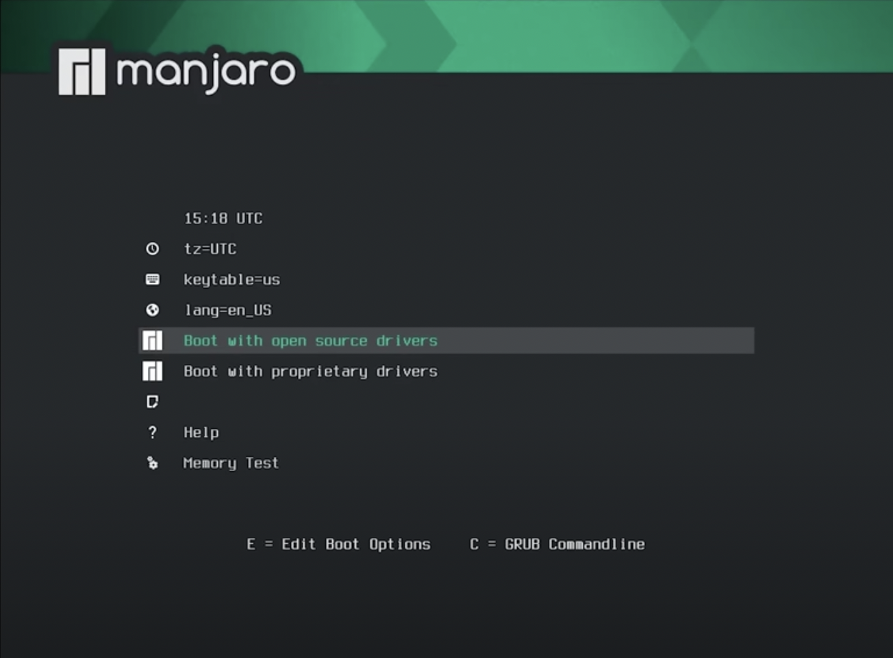

# 记录装 Ubuntu 双系统的过程

机型为联想 Yoga14s amd 版, 大体按照 https://www.cnblogs.com/masbay/p/10745170.html 这篇文章进行操作(情况为 UEFI 加单硬盘), 这里主要记录不同之处.

首先是 BIOS, 先按 F2, 到 Securty 中 disable Secure Boot, 然后保存并重启. 按 F12, 选择 USB HDD 开始安装系统.

在手动分区时, 分区类型全部选择逻辑分区即可.

第一次分区完准备安装以后卡死过一次, 重启然后重复操作发现没有影响, 装机之前也没有备份, 感觉装双系统装崩的可能性还是比较小的.

----------------------------------------------2022.04.09 更新----------------------------------------------

有一堆作业实验没做, 但是不想学习, 于是又在老机子上装了第三个操作系统 Manjaro, 这时对装系统还是比较熟练的了, 下面记录下大体步骤.

1. 获取镜像, 这里直接从 Manjaro [官网](https://manjaro.org/) 下载, 共有 3 种可选的桌面, 这里选择 [KDE 版](https://download.manjaro.org/kde/21.2.5/manjaro-kde-21.2.5-220314-linux515.iso).

2. 将下载后的 `iso` 文件刻入 U 盘 (Mac 下可以用 [balenaEtcher](https://www.balena.io/etcher), Windows 可以用 [软碟通](https://cn.ultraiso.net/) 或者 [rufus](https://rufus.ie/zh/)).

3. 利用 Windows 的磁盘管理工具分出一块磁盘空间.

4. Disable secure boot, 开机时按 F12 选择 USB HDD 安装系统, 这时界面如下图

    

5. 在该界面下可以选择时区 (tz, timezone), 语言 (lang), 进去再选也行, 之后选择开源驱动, 按 Enter, 就安装完了.

6. 分区配置. 安装完以后将来到 Manjaro 的欢迎页, 选择最下面的"启动安装程序" (如果没改语言可能是英语的 Installation 之类的), 前面欢迎和位置页可以选语言. 分区时可以只分 `/` 或者细分 `/home`, `/opt` 以及交换分区等. 这里我只分了 `/home` 和 `/`. 最重要的是要**配置引导**, 选中第一个分区 (通常是几百兆, 文件系统为 FAT32 的引导分区), 选择编辑, 挂载点选 `/boot/efi`, 就完成了分区配置. 之后重启岂可.

安装完成后的配置:

1. 换源. 首先打开终端 (Manjaro 的终端真是吊打 Ubuntu, 默认 shell 就是 zsh, 而且带 syntax highlighting 和 autosuggestion), 输入`sudo pacman-mirrors -i -c China -m rank` 就会弹出一个按延时排序的镜像列表供选择, 果断选择妮可镜像~~(事实上 nju 的好像比妮可的快一点).~~ pacman 是 Manjaro 下的包管理器, 换源之后输入 `sudo pacman -Syy` 来同步软件包数据库 (类似 `apt update`). `sudo pacman -Syu` 可以进行所有软件的 upgrade. 由于 Manjaro 是滚动更新的, 经常 upgrade 可以保持系统始终是最新版. (最好每次开机都进行 `sudo pacman -Syu`).

2. 中文输入法. 首先增加中文社区的源，在 `/etc/pacman.conf` 中添加 `archlinuxcn` 源：

    ```ini
    [archlinuxcn]
    SigLevel = Optional TrustedOnly
    Server = https://mirrors.ustc.edu.cn/archlinuxcn/$arch
    ```

    之后同样是 `sudo pacman -Syy`, 然后 `sudo pacman -Sy archlinuxcn-keyring` 以导入 `GPG key`，否则的话会报签名验证失败无法安装的错. 之后输入如下命令:

    ```shell
    $ sudo pacman -S fcitx-im fcitx-configtool fcitx-sogoupinyin
    ```
    
    然后添加文件 `~/.xprofile`: 
    
    ```shell
    export GTK_MODULE=fcitx
    export QT_IM_MODULE=fcitx
    export XMODIFIERS="@im=fcitx"
    ```

​		完成后重启即可.

3. 其他包管理器. pacman 不能直接安装 AUR (Arch User Repository), 因此需要 AUR 助手, 目前常用的有 yay 和 paru (Rust 编写). 都可以用 pacman 安装.

4. 梯子. 直接 `yay -S clash` 即可.

5. 下面重点记录一下美化的过程.

    作为一个不资深果粉, 肯定是要把主题刷成 MacOS Monterey 的. KDE 版本的直接在系统设置->外观里就可以进行美化, 但是从系统的主题商店即使挂了梯子也下载不到主题, 这时只能去 GitHub 上下载.

    首先访问主题网站: https://www.pling.com/, 搜 Monterey KDE, 得到 https://www.pling.com/p/1567584/, 循着 source 来到 GitHub 页面, 按照 README 的提示走就行. 安装完成后就可以去设置里更换. 值得注意的是按钮的位置如果要调到左边, 需要在窗口装饰元素->标题栏按钮里面修改.

    主题对了, 还有顶上的菜单栏和底下的 Docker 要搞. 

    先处理 Docker. 首先装上 `latte-dock`: `sudo pacman -S latte-dock`. 之后输入`latte-dock` 以启用. 然后就可以把原本底下的 Panel 去掉. 之后搜索 "macos layout for latte dock", 找到 https://store.kde.org/p/1399346/, 点击右边的 Download, 解压后在 `latte-dock` 的配置中引入即可.

    然后是菜单栏: 在桌面进行添加面板->应用程序菜单栏, 上方出现一个菜单栏. 之后右键该菜单栏添加组件, 内容见仁见智, 这里我从左到右的排列是: 应用程序启动器 全局菜单 总 CPU 使用情况 显示桌面 系统托盘 电池和亮度 数字时钟. 最后放上美化的最终成果:

6. Vivado 公交车, 之前为了做数电实验专门给 Ubuntu 分了 60 G 的磁盘空间装 Vivado, 并把这个分区挂载到了 Ubuntu 的 `/mnt`, 现在想让它发挥余热, 也挂到 Manjaro 上用. 打开 GParted, 发现这块分区已经自动被挂载了, 只是没有挂载点, 这时只要修改 `/etc/fstab` 就可以了:

    ```shell
    $ sudo blkid # 找到磁盘的 UUID
    $ sudo nvim /etc/fstab # 添加到文件里
    ```

    启动 Vivado, 这垃圾软件果然不让我失望, 还缺个依赖 (libtinfo.so.5), Ubuntu 也缺, 做法是

    ```shell
    $ sudo apt install libtinfo-dev
    $ sudo ln -s /lib/x86_64-linux-gnu/libtinfo.so.6 /lib/x86_64-linux-gnu/libtinfo.so.5
    ```

    Manjaro 没有 `libtinfo-dev` 这个库, 万能的 arch 社区表示 Manjaro 只有 `libtinfo.so.6`, `libtinfo.so.5` 是 `ncurses5-compat-libs` 提供的.

    运行后发现 Vivado 连 scale 都不懂得跟随系统, 需要通过 Tools->Settings->Display->Scaling 修改.

7. 一些好用的软件: 待更.

8. 一些踩坑和未做:

    首先是 wine, 由于 arch 的软件包过于先进, 导致 wine 只有 wine5 和 wine6 可以用, 而 wine6 虽然包名里带个 stable, 但是很不稳定. TIM 和微信都依赖 wine6, 但是我的 TIM 有很多字体显示不出来, 参考了 [arch wiki](http://linux-wiki.cn/wiki/Wine%E7%9A%84%E4%B8%AD%E6%96%87%E6%98%BE%E7%A4%BA%E4%B8%8E%E5%AD%97%E4%BD%93%E8%AE%BE%E7%BD%AE) 和 [知乎](https://zhuanlan.zhihu.com/p/476452504) 修改了注册表依然不奏效, 暂且作罢. 不过微信暂时能用. QQ 依赖 wine5, 可以解决字体无法显示问题, 但是每次关闭后重开都要重装 QQ, 不知为何. 按 [arch wiki](https://wiki.archlinux.org/title/Deepin-wine#Deepin-wine_applications_fails_to_start) 的说法, 这可能跟 KDE 也有关系.

    然后是驱动, 闲着蛋疼在设置->硬件设定里装了 video-vesa, 导致开机无法进入 KDE 桌面 (提一嘴, KDE 真不如 GNOME 好用), 搜了一圈, 有说是 NVIDIA 显卡的问题 (但我的机子是 AMD 核显, 不存在这个问题); 也有说是 Qt 的锅, 因为输入 `kstart5 plasmashell` 手动进入 KDE 桌面会报如下错误:

    ```
    qt.qpa.xcb: couldnot connect to display
    qt.qpa.plugins: couldn’t load the Qt platform plugin "xcb" in "" even though it was found.
    ```

    同时建议重装 xxx 来修复此问题, 全部重装了一遍发现没用. 最后的解决方案是, 先去 tty, `mhwd -l` 看看都装了什么驱动, `sudo mhwd -r pci video-vesa` 删掉 video-vesa 即可.

    